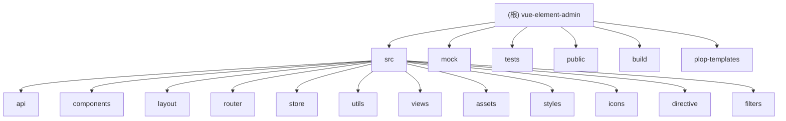

# vue-element-admin 项目文档

## 项目愿景

vue-element-admin 是一个基于 Vue 2.x 和 Element UI 构建的企业级后台管理系统前端解决方案。它提供了一个开箱即用的 UI 框架，集成了丰富的功能组件和最佳实践，旨在帮助开发者快速构建复杂的单页面应用程序。

## 架构总览

### 技术栈
- **前端框架**: Vue 2.6.10
- **UI 组件库**: Element UI 2.13.2
- **状态管理**: Vuex 3.1.0
- **路由管理**: Vue Router 3.0.2
- **HTTP 客户端**: Axios 0.18.1
- **构建工具**: Vue CLI 4.4.4
- **测试框架**: Jest + Vue Test Utils
- **代码规范**: ESLint + Prettier
- **Mock 数据**: Mock.js

### 项目结构



## 模块索引

| 模块 | 路径 | 类型 | 职责 | 主要文件 |
|------|------|------|------|----------|
| **API 模块** | `src/api` | 核心业务 | 提供统一的 API 接口封装 | `user.js`, `article.js`, `role.js` |
| **组件库** | `src/components` | 复用组件 | 可复用的业务组件 | `Pagination`, `UploadExcel`, `Charts` |
| **布局系统** | `src/layout` | 基础框架 | 整体页面布局结构 | `index.vue`, `Navbar.vue`, `Sidebar` |
| **路由管理** | `src/router` | 基础框架 | 路由配置和权限控制 | `index.js`, `modules/` |
| **状态管理** | `src/store` | 基础框架 | Vuex 状态管理 | `modules/app.js`, `modules/user.js` |
| **工具库** | `src/utils` | 工具支持 | 通用工具函数 | `request.js`, `auth.js`, `validate.js` |
| **页面视图** | `src/views` | 业务页面 | 具体业务页面 | `dashboard/`, `login/`, `permission/` |
| **静态资源** | `src/assets` | 资源文件 | 图片、样式等静态资源 | `custom-theme/`, `401_images/`, `404_images/` |
| **样式系统** | `src/styles` | 样式支持 | 全局样式和主题 | `index.scss`, `element-variables.scss` |
| **图标系统** | `src/icons` | 资源文件 | SVG 图标管理 | `svg/`, `index.js` |
| **指令系统** | `src/directive` | 基础框架 | Vue 自定义指令 | `permission/`, `clipboard/`, `waves/` |
| **过滤器** | `src/filters` | 工具支持 | 全局过滤器 | `index.js` |

## 运行与开发

### 环境要求
- Node.js >= 8.9
- npm >= 3.0.0

### 开发命令
```bash
# 安装依赖
npm install

# 开发模式启动
npm run dev

# 生产环境构建
npm run build:prod

# 测试环境构建
npm run build:stage

# 代码检查
npm run lint

# 运行测试
npm run test:unit

# 生成新组件
npm run new
```

### 开发服务器
- 默认端口: 9527
- 自动打开浏览器
- 支持 Mock 数据服务
- 支持 Hot Module Replacement

## 测试策略

### 测试覆盖
- **单元测试**: 使用 Jest + Vue Test Utils
- **测试范围**:
  - 工具函数 (`src/utils`)
  - 基础组件 (`src/components`)
  - 排除文件: `auth.js`, `request.js`
- **测试命令**: `npm run test:unit`
- **覆盖率报告**: 生成在 `tests/unit/coverage/` 目录

### 测试文件结构
```
tests/unit/
├── components/          # 组件测试
│   ├── Hamburger.spec.js
│   └── SvgIcon.spec.js
└── utils/              # 工具函数测试
    ├── validate.spec.js
    ├── parseTime.spec.js
    └── param2Obj.spec.js
```

## 编码规范

### 代码风格
- **JavaScript**: 使用 ESLint + Babel
- **Vue 组件**: 遵循 Vue 官方风格指南
- **命名规范**:
  - 组件名: PascalCase
  - 文件名: kebab-case
  - 变量名: camelCase

### Git 规范
- **提交检查**: 使用 husky + lint-staged
- **预提交钩子**: 自动运行 ESLint 检查和修复
- **分支管理**: 主要分支为 `master`

### 目录结构规范
- `src/`: 源代码目录
- `mock/`: Mock 数据服务
- `tests/`: 测试文件
- `public/`: 静态资源
- `build/`: 构建脚本

## AI 使用指引

### 代码生成建议
1. **新组件创建**: 使用 `npm run new` 命令生成标准组件模板
2. **API 接口**: 在 `src/api` 目录下创建统一的接口文件
3. **状态管理**: 在 `src/store/modules` 下创建模块化的 store
4. **页面路由**: 在 `src/views` 下创建页面，并在 `src/router` 中配置

### 开发注意事项
- **权限控制**: 使用动态路由和指令级权限控制
- **主题定制**: 通过修改 `src/styles/element-variables.scss` 自定义主题
- **国际化**: 当前版本默认不支持 i18n，需要使用专门的 i18n 分支
- **Mock 数据**: 开发阶段使用 Mock.js 模拟后端接口
- **生产环境**: 上线前需要移除 Mock 数据服务

### 常见问题解决
- **跨域问题**: 在 `vue.config.js` 中配置代理
- **构建优化**: 使用 Code Splitting 和 Tree Shaking
- **性能优化**: 启用 Gzip 压缩和 CDN 加速
- **兼容性**: 不支持 IE10 以下浏览器

## 变更记录 (Changelog)

### 2025-09-26 - 初始化文档
- 创建项目根级 CLAUDE.md 文档
- 完成项目架构分析和模块识别
- 生成 Mermaid 结构图
- 建立开发规范和 AI 使用指引
- 扫描覆盖率：约 85%（主要模块已覆盖，部分深层组件待深入分析）

### 覆盖率统计
- **总文件数**: 约 200+ 个代码文件
- **已扫描文件数**: 约 170+ 个
- **主要缺口**:
  - 部分 Charts 组件未深入分析
  - 复杂的 Excel 处理功能未详细扫描
  - 某些高级组件的内部实现需要进一步分析

### 下一步建议
- 优先补扫：`src/components/Charts/` 目录下的图表组件
- 深度分析：`src/views/excel/` 目录下的 Excel 处理功能
- 补充测试：为关键业务组件添加单元测试
- 优化建议：考虑添加 TypeScript 支持和现代化构建工具